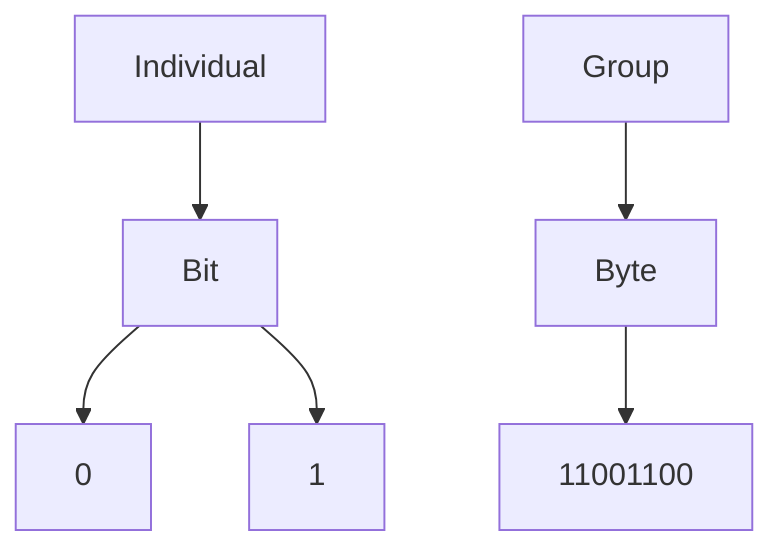
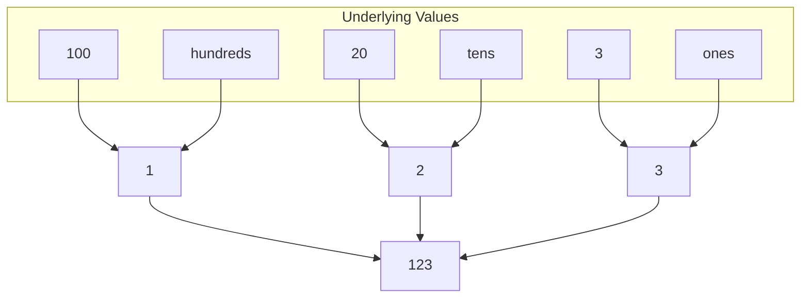
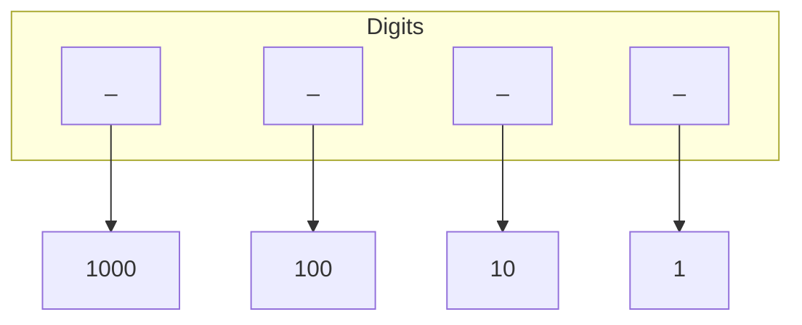
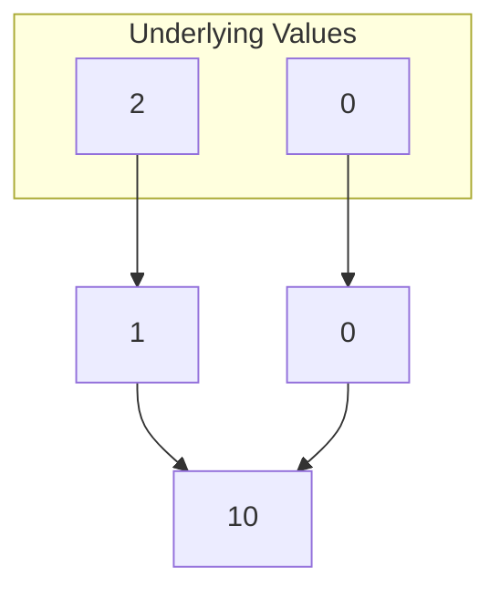
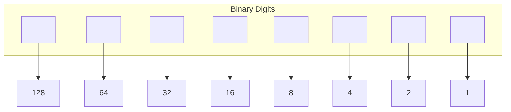
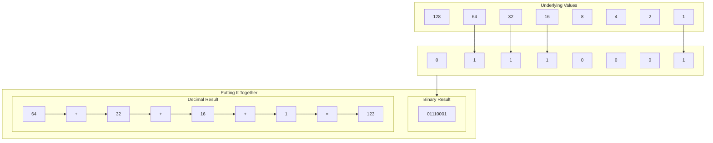
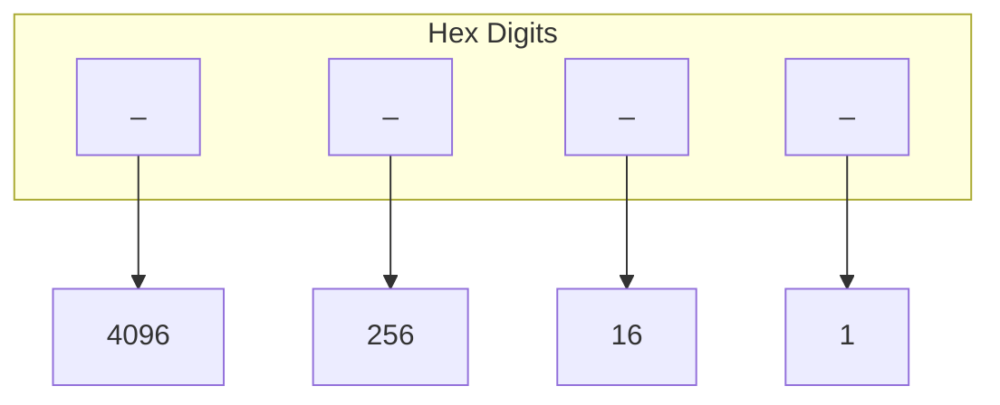

# Extracts

When I write these dev blogs I tend to get a little verbose or distracted. When that happens I extract the portion that is overly verbose or not on topic and place it in here as an extract.

## Table of Contents

- 02 - I Can Write a Function
  - [Decimal, Binary, Hexadecimal](https://github.com/GaryMcD/Learning-Rust-A-Lesson-in-Humility/blob/main/Extracts.md#decimal-binary-hexadecimal)
    - [Human Numbers](https://github.com/GaryMcD/Learning-Rust-A-Lesson-in-Humility/blob/main/Extracts.md#human-numbers)
    - [Back To Computers](https://github.com/GaryMcD/Learning-Rust-A-Lesson-in-Humility/blob/main/Extracts.md#back-to-computers)
    - [Hexadecimal](https://github.com/GaryMcD/Learning-Rust-A-Lesson-in-Humility/blob/main/Extracts.md#hexadecimal)

***

### Decimal, Binary, Hexadecimal

For anyone following along who is not familiar with bytes, bits, hexademical, decimal, etc. and the relationship of them all. Let me try and give a quick lesson. Bear in my mind, I taught this to myself - so I am not a professor of computer science.

Computers communicate with electricty :zap: - they translate the electricty into either a `1` or a `0`. They represent `on` and `off` respectively (though this doesn't necesarily mean no electricity and some electricty, usually it is above/below some bound of voltage/amperage).

When they have a lot of information to communicate they use a long stream of `1`s and `0`s. The two computers on either end of this communication have agreements about what different series of `1`s and `0`s might mean. They also have some sort of agreement about the pace at which they check for electricity to determine if the next value is a `1` or `0`. Individually, a `1` or `0` can't communicate much information. When computers utilize these agreed upon series they can begin to communicate boundless information. :speech_balloon: It boils down the same principles as linguistics. :abc: Individual letters may not have a great capacity to communicate information, but when we combine them we end up with words, and sentences, and paragraphs, and books and so on and so forth. This part of computer science is something I find fascinating, and online research can send you down a beautiful rabbit hole rich in history. The advent of modern computing ontop of just `1 on` and `0 off` is phenomonal.

A single `1` or `0` is called a `bit`. [Wikipedia "Bit"](https://en.wikipedia.org/wiki/Bit). A group of 8 `bit`s is called a `byte`. [Wikipedia "Byte"](https://en.wikipedia.org/wiki/Byte).



We should take a look at how two computers communicate a number, but first - how do two humans communicate numbers?

#### Human Numbers :busts_in_silhouette: :1234:

There are four concepts to get out of this next section about how humans communicate numbers:

1. Digits Have Underlying Value
2. Moving Left Increases a Digits Underlying Value
3. The Base Underlying Value Represents The Amount of Characters We Can Represent a Single Digit With
4. When We Reach the Maximum for a Digit, We Set To Zero, Carry 1, and Continue Counting.

When we communicate numbers to each other, there is a lot happening in our brains under the hood to understand *what a number means*, and most of the world has agreed upon the same set of rules to use when determining *what a written number means*.

Generally speaking, if I asked someone what `number` this is: `123`, they would say `one-hundred-twenty-three`.

Notice that they instinctively broke it down into its digits and the value (or quantity) that each represents.

`one` hundred. `two` tens - aka "twenty". `three`.

Written numbers across most of the world follow this format. That is, every digit we grow to the left represents 10 times as much as the digit to its right.



This pattern is referred to as `base ten`. What that means is that every digit is multiplying the last digit by ten. I am going to refer to this as `decimal` for the remainder of this document.

If I told you I had a 4 digit number (in `decimal`), you could easily determine the minimum value of that 4th digit.



What we did is essentially 10 to the power of 4. `10 * 10 * 10 * 10 = 1000`. We could continue this indefinitely to determine the underlying value of any digit in `decimal`.

This directly correlates to the number of characters we can represent each digit with. Notice that we only use the following characters for any numerical digit: `0`, `1`, `2`, `3`, `4`, `5`, `6`, `7`, `8`, `9`. How many are there? 10! (Remember it is called `base ten`?).

What happens when we are using `9` and want to make the number larger? We don't use some other character like `@` to be a number great than `9`, so we have no new characters to use. Instead we set `9` to `0` and carry `1` to the digit on our left. Example below if reading that didn't make sense.

```
 89
  1 +
 --
 ??

 First we add 1 to 9. But there isn't a single character to represent 10. So we set 9 to 0, and carry the 1 one over.

 1
 89
  1 +
 --
 ?0

 Now we are left with adding 1 to 8. What is 1 higher than 8? 9!

 1
 89
  1 +
 --
 90
```

These four concepts can apply and translate to any `base`.

#### Back To Computers :computer:

We had 10 characters we could use for `decimal` (0-9), but how many characters do computers have? Well as we said above, they only have `1` and `0`. So that means computers can only communicate in `base two`. I am going to refer to this as `binary` for the rest of this document.

The first digit still represents 1. So if a computer sends a number, and it sends just one digit, and that digit is 1. The number they are sending is 1. But how do they make the number larger? The same way we do in `decimal`. It was one of the principles I mentioned above.

> When We Reach the Maximum for a Digit, We Set To Zero, Carry 1, and Continue Counting.

```
In Binary

  1
  1 +
  -
  ?

  We don't have a character to represent a value greater than 1. So we set our current digit to 0, and carry 1.

 1
  1
  1 +
 --
 ?0

  Now we have a carried 1, but nothing it is added to, so it is dropped down into our final value.

 1
  1
  1 +
 --
 10
```

We just did 1 + 1 in `binary` and found out that 2 is represented as 10. :exclamation: :question: That can be a bit mind bending to someone that has never worked in `binary`. Remember what we learned above about how humans communicate numbers?

> Moving Left Increases a Digits Underlying Value

Well, in `binary`, now that we did 1 + 1 and found the value for 2 we can see this principle is true here as well. The second digit has an underlying value of 2 (as opposed 10 in `decimal`).



When we were in `decimal` we kept multiplying by 10 as we moved our digits left. What about `binary`? You guessed it, we multiply by 2. This might make more sense for some readers if we start with 2 and add 1 twice in `binary`. In `decimal` 2 + 1 + 1 = 4, so at the end of this demonstration we will have the value 4 in `binary`.

```
Binary

 10  <-- decimal 2 represented in binary.
  1 +
 --
 ??

 On the far right, 1 + 0 = 1.
 And then on the far left 1 + nothing = 1.

 10  <-- decimal 2 represented in binary.
  1 +
 --
 11 <-- This was the result of doing 2 + 1 in binary. So 11 in binary is 3 in decimal.

 Now let's add one more, which we know will be 3 + 1 = 4 in decimal.

 11  <-- decimal 3 represented in binary.
  1 +
 --
 ??

 On the far right, 1 + 1 is 2. But in binary we don't have the character 2, so we set our current digit to zero and carry a 1 to the left.

 1
 11  <-- decimal 3 represented in binary.
  1 +
 --
 ?0

 On the far left now, we have our carried 1, and the original 1 present when we started.
 So 1 + 1. We don't have a 2 in binary, so set to zero, carry 1 to the left.

 11
  11  <-- decimal 3 represented in binary.
   1 +
 ---
 ?00

 And the final carried 1 has nothing to be added to. Let's drop it into our final result.

 11
  11  <-- decimal 3 represented in binary.
   1 +
 ---
 100 <-- This was the result of doing 3 + 1 in binary. so 100 in binary is 4 in decimal.
```

This pattern we have unraveled in `binary`, much like `decimal` continues indefinitely. The underlying value of the digit is continuously multipled by 2 as we add digits on the left.



Let us put this all together and figure out how a computer would communicate the `decimal` number 123 in `binary`? 

1. In the `binary` digit list above, using 128 would be too much. So we will set the 64 digit to 1.
2. 123 - 64 = 59. Meaning we need to represent 59 with the rest of our bits. 64 is too large, so the next value will be 32.
3. 59 - 32 = 17. Meaning we need to represent 17 with the rest of our bits. 32 is too large, so the next value will be 16.
4. 17 - 16 = 1. Meaning we need to represent 17 with the rest of our bits. 16 is too large, and so is 8, and so is 4, and so is 2. So the next value will be 1.



Did all of that make sense? I hope it did, because we are about to enter the land of hexadecimal and these principles get used again.

#### Hexadecimal

In hexadecimal - you cry. Not really, but we are going to begin mixing letters and numbers, which sounds like middle school algebra and I cried a lot doing my algebra homework. :sob: I am going to refer to this as `hex` for the rest of this document.

[Wikipedia "Hexadecimal"](https://en.wikipedia.org/wiki/Hexadecimal)

The gist of `hex` is that it isn't `base ten` or `base two`, it is `base 16`. Each digit can have 16 characters to represent it's value, meaning that as we move left the value of our digits multiply by 16. Do you remember that in `binary` the fourth digit represented 16? This means that a single digit in `hex` is equal to four digits in `binary`. `Hex` ends up being a more efficient way to represent `binary` information as we have to use less digits to represent values.

> `Hex` ends up being a more efficient way to represent `binary` information as we have to use less digits to represent values.

Wouldn't that also be true of `decimal`? Didn't we represent `decimal` 123 with 4 digits in `binary`, meaning that `decimal` was more "efficient" (because it was only 3 digits). Yes. But! `Hex` *_exactly_* matches up with every fourth digit of `binary`. Where as `decimal` never lines up with any `binary` digits. This perfect alignment is what makes `hex` an efficient `representation` of `binary`.



Let us look at 123 in the different bases.

| `Decimal` | `Binary` | `Hex` |
| :-------: | :------: | :---: |
| :one::two::three: | :zero::one::one::one::zero::zero::zero::one: | :seven:E | 

*sidebar* When I started that table, I thought there would be an E emoji, and now, out of stubborness I refuse to go back.

:collision: Whoa! Is that an `E`? Sure is. The characters used for `hex` (in order) are: `0`, `1`, `2`, `3`, `4`, `5`, `6`, `7`, `8`, `9`, `A`, `B`, `C`, `D`, `E`, `F`. (Lowercase versions of the letters are also used).

Notice we went from 8 digits in `binary` to 2 digits in `hex` when representing the decimal number 123. So if you're writing or recording information about `binary` values, you're going to save yourself quite a bit of space and time writing it in `hex`.

I won't stay on `hex` any longer as our explanation of `decimal` and `binary` covered the underlying patterns and principles of numbers represented in various bases. There is a lot more you could read that pertain to these topics of `binary`, `hex`, and how computers communicate, etc.

Here are some related Wikipedia articles:

[Radix](https://en.wikipedia.org/wiki/Radix) <-- Technical explanation of the relationship between a base and the characters used to represent it.

[Nybble](https://en.wikipedia.org/wiki/Nibble) <-- Four Bits.

[Binary Code](https://en.wikipedia.org/wiki/Binary_code) <-- Sort of like "putting it all together" at a high level. Bits = Code = Instructions for Computers.

[Endian](https://en.wikipedia.org/wiki/Endianness) <-- Agreed upon rules used for computers to consider the *order* of the bits.

[Character Encoding](https://en.wikipedia.org/wiki/Character_encoding) <-- Relationship between binary code and the characters we are presented on our screens.

[Integer](https://en.wikipedia.org/wiki/Integer_(computer_science)) <-- Integers/Numbers in Computer Science. Good time to learn about signed vs unsigned. If you were wondering how we get negative numbers.
